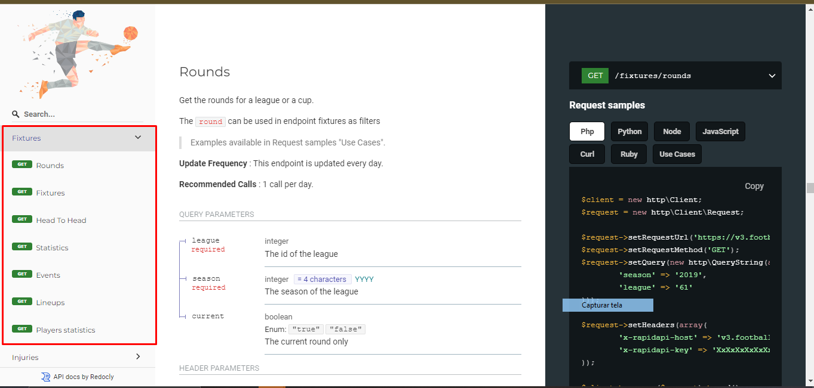
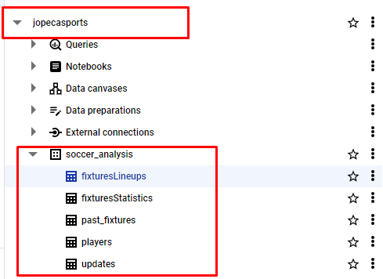
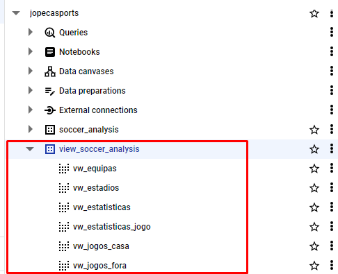
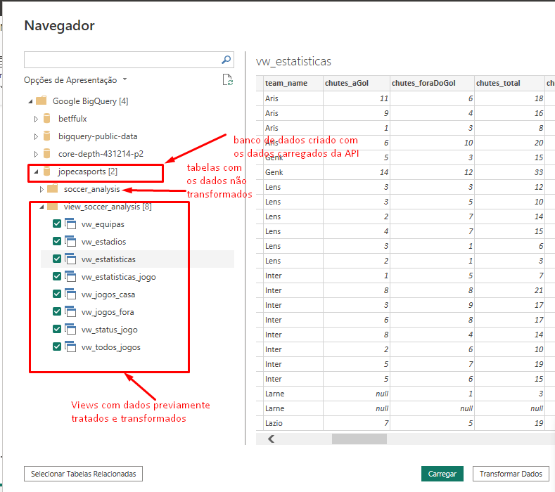
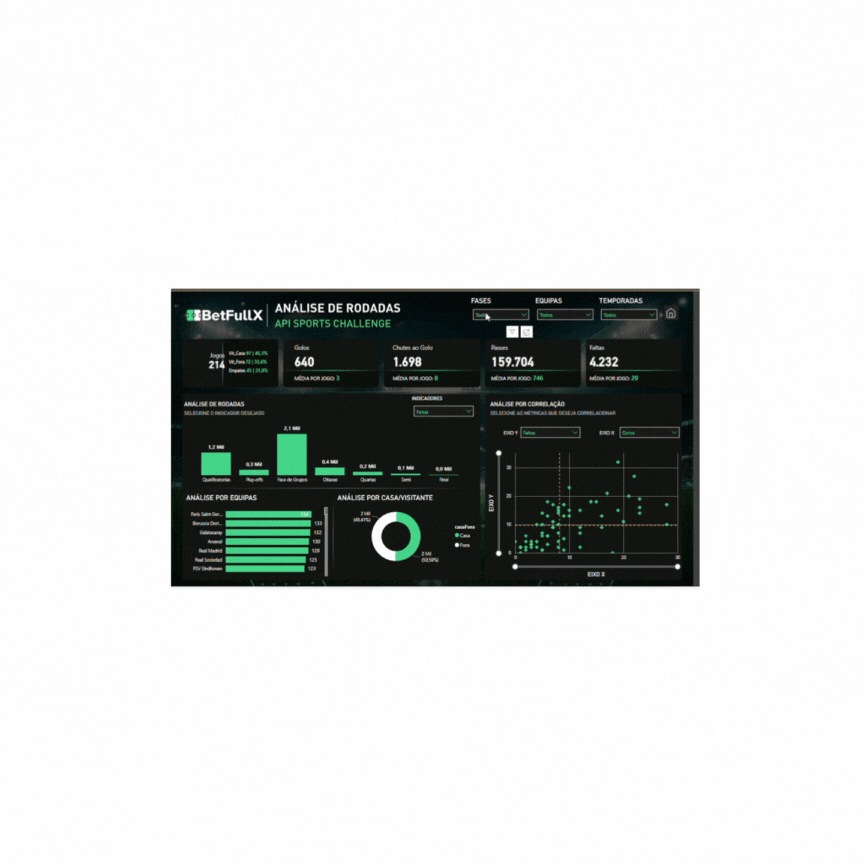

# Projeto de BI: Análise de Dados de Partidas de Futebol com API-Sports, Google BigQuery e Power BI

## 1. Introdução - Visão Geral

Este projeto tem como objetivo a extração de dados de partidas de futebol da Liga dos Campeões usando a API-Sports, o armazenamento e processamento dos dados no Google BigQuery, e a realização de análises no Power BI. O foco principal é treinar habilidades de extração de dados de uma API usando Python, popular os dados em um Banco de Dados e usar SQL para o tratamento dos dados e análisar os resultados das partidas com Power BI para gerar insights sobre desempenho e tendências.

### 1.1. Tecnologias Utilizadas

- **API-Sports:** Fonte de dados para fixtures (partidas) e estatísticas de futebol.
- **Google BigQuery:** Plataforma de armazenamento e processamento de dados.
- **Power BI:** Ferramenta de visualização para análise de dados.
- **Python:** Linguagem usada para a automação do processo de ETL (Extração, Transformação e Carga).

### 1.2 Fluxo de Trabalho

1. **Python - Coleta de dados via API**: Extração dos dados das partidas de futebol a API Sports.
2. **Armazenamento no Google BigQuery**: Carregamento desses dados no Google BigQuery para realizar as transformações necessárias.
3. **SQL - ETL no Google BigQuery**: As transformações dos dados foram realizadas utilizando SQL, agregando e processando os dados para análise posterior.
4. **Visualização no Power BI**: Os dados transformados no Google BigQuery são processados,visualizados e analisados no Power BI, com a criação do dashboard interativo.


## 2. Extração, tatamento e carga dos dados

### 2.1 Extração de Dados
A extração dos dados é feita via requisições HTTP (GET) para a API-Sports. São obtidos dados sobre partidas passadas e futuras:

 

- **API:** [API-Sports](https://www.api-football.com/documentation-v3)
- **Método de extração:** Requisição HTTP (GET)

  
```python
    # Definição das variáveis de ambiente
API_KEY = 'meter a chave da API'
API_URL = 'https://v3.football.api-sports.io' # URL base da API da API-Sports
PROJECT_ID = 'jopecasports' # ID do projeto no BigQuery
DATASET_NAME = 'soccer_analysis' # Nome do dataset no BigQuery
FULL_LOAD_DATE = '2023-01-01' # Data para carga completa inicial
LEAGUE = 2 # ID da liga na API-Sports
SEASON = 2023 # Ano da temporada
```
- **Cabeçalho da requisição:**
```
HEADERS = {
        'x-rapidapi-key': API_KEY
    }
 ```

- **EndPoints principais:**
    - **past_fixtures:** Para obter partidas passadas.
    - **future_fixtures:** Para obter partidas futuras.

    ```python
    endpoints = [
        {
            "table": "past_fixtures",
            "path": "fixtures",
            "params": {
                "league": LEAGUE,
                "season": SEASON
            }
        },
        {
            "table": "future_fixtures",
            "path": "fixtures",
            "params": {
                "league": LEAGUE,
                "season": SEASON
            }
        }
    ]
    ```

### 2.2 Carga para o Google BigQuery

- **Projeto:** `jopecasports`
- **Dataset:** `soccer_analysis`
- **Formato dos dados:** JSON
- **Processo de carga:** Utilização da biblioteca `google.cloud.bigquery` para enviar dados para as tabelas do BigQuery.
    ```python
    from google.cloud import bigquery
    
    client = bigquery.Client(project=PROJECT_ID)
    def load_data_to_bigquery(client, dataset_name, table_name, dataframe, write_disposition):
        job_config = bigquery.LoadJobConfig(
            write_disposition=write_disposition
        )
        table_id = f"{PROJECT_ID}.{dataset_name}.{table_name}"
        load_job = client.load_table_from_dataframe(dataframe, table_id, job_config=job_config)
        load_job.result()  # Espera até que o job seja concluído
    ```

    

### 2.3 Transformação dos Dados

- **Transformações aplicadas:**
  - Atualização de parâmetros para cargas incrementais.
  - Filtragem de dados para carregar apenas informações novas (incremental load).
    ```python
    def incremental_params_update(table, params, last_update, now):
        if table == "past_fixtures":
            params.update({
                'from': last_update.strftime('%Y-%m-%d'),
                'to': (now - timedelta(days=1)).strftime('%Y-%m-%d')
            })
        elif table == "future_fixtures":
            params.update({
                'from': now.strftime('%Y-%m-%d')
            })
        return params
    ```

### 2.4. Transfornação dos dados no Google BigQuery
Um dos principais motivos em carregar os dados da  API para um banco de dados e que também constitui boas práticas, é a possibilidade de transformar os dados para aumentar a performance de processamento da ferramenta de dataviz. Por esse motivo durante o processo de transformação dos dados, realizei várias consultas SQL para transformar os dados brutos em informações estruturadas e organizadas. Aqui está um resumo das principais views criadas:



#### 1. **vw_jogos_fora**

Essa query seleciona informações de partidas onde o time jogou como visitante (fora de casa). Ela extrai dados como o nome do juiz, data da partida, status, temporada, time visitante e estatísticas de gols por períodos (primeiro tempo, segundo tempo, prorrogação, penalti).

- **Tabela de origem:** `soccer_analysis.past_fixtures`
- **Campos principais:** `jogo_id`, `juiz_nome`, `data`, `status_id`, `time_id`, `gols`, `gols_primeiroTempo`, `gols_segundoTempo`, etc.
- **Filtro:** Partidas onde o time jogou fora de casa (campo fixo `'Fora'`).
  
```sql
SELECT 
	CAST( fixture__id AS STRING ) as jogo_id,
	fixture__referee as juiz_nome,
	fixture__date as data,
	fixture__status__short as status_id,
	CAST( league__id AS STRING ) as liga_id,
	league__season as temporada,
	league__round as rodada,
	CAST(teams__away__id AS STRING ) AS time_id,
	teams__away__name AS time_nome,
	teams__away__logo AS time_logoUrl,
	teams__away__winner AS time_vitoria,
	goals__away AS gols,
	score__halftime__away AS gols_primeiroTempo,
	score__fulltime__away AS gols_segundoTempo,
	score__extratime__away AS gols_prorrogacao,
	score__penalty__away AS gols_penalti,
	CAST(fixture__venue__id AS STRING) AS estadio_id,
	'Fora' AS casaFora
FROM `soccer_analysis.past_fixtures`
```

#### 2. **vw_jogos_casa**

Essa query seleciona informações de partidas onde o time jogou como mandante (casa). Ela é semelhante à `vw_jogos_fora`, mas captura os dados do time que jogou em casa.

- **Tabela de origem:** `soccer_analysis.past_fixtures`
- **Campos principais:** `jogo_id`, `juiz_nome`, `data`, `status_id`, `time_id`, `gols`, `gols_primeiroTempo`, `gols_segundoTempo`, etc.
- **Filtro:** Partidas onde o time jogou em casa (campo fixo `'Casa'`).
```sql
   SELECT 
	CAST( fixture__id AS STRING ) as jogo_id,
	fixture__referee as juiz_nome,
	fixture__date as data,
	fixture__status__short as status_id,
	CAST( league__id AS STRING ) as liga_id,
	league__season as temporada,
	league__round as rodada,
	CAST(teams__home__id AS STRING ) AS time_id,
	teams__home__name AS time_nome,
	teams__home__logo AS time_logoUrl,
	teams__home__winner AS time_vitoria,
	goals__home AS gols,
	score__halftime__home AS gols_primeiroTempo,
	score__fulltime__home AS gols_segundoTempo,
	score__extratime__home AS gols_prorrogacao,
	score__penalty__home AS gols_penalti,
	CAST(fixture__venue__id AS STRING) AS estadio_id,
	'Casa' AS casaFora
FROM `soccer_analysis.past_fixtures`
```

#### 3. **vw_jogos**

Esta query une os resultados das views `vw_jogos_casa` e `vw_jogos_fora` utilizando a cláusula `UNION ALL`, combinando as informações de todas as partidas, independente de serem jogadas em casa ou fora.

- **Tabelas de origem:** `view_soccer_analysis.vw_jogos_casa` e `view_soccer_analysis.vw_jogos_fora`
- **Resultado:** Combina os dados de todas as partidas, sejam jogadas em casa ou fora.

```sql
SELECT * FROM
    `view_soccer_analysis.vw_jogos_casa`

UNION ALL

SELECT  * FROM
    `view_soccer_analysis.vw_jogos_fora`
```

#### 5. **vw_equipes**

Essa query seleciona informações distintas sobre as equipes, como o nome, o logo e o ID. Ela evita duplicidade de times ao usar `DISTINCT`.

- **Tabela de origem:** `view_soccer_analysis.vw_todos_jogos`
- **Campos principais:** `time_id`, `time_nome`, `time_logoUrl`

```sql
SELECT DISTINCT
    time_id,
    time_nome,
    time_logoUrl
FROM `view_soccer_analysis.vw_todos_jogos`
```

#### 7. **vw_estatisticas**

Essa query agrupa e processa as estatísticas das partidas (como chutes a gol, posse de bola, faltas, cartões) a partir dos dados brutos na tabela `fixturesStatistics`. Os dados são processados por time e partida.

- **Tabela de origem:** `soccer_analysis.fixturesStatistics`
- **Campos principais:** `jogo_id`, `team_id`, `team_name`, `chutes_aGol`, `posseDeBola`, `passes_total`, etc.
- **Operações:** Uso de agregações (`MAX`) para capturar as estatísticas específicas, como chutes e posse de bola.

```sql
WITH stats_aggregated AS (
  SELECT
    SAFE_CAST(fixture AS STRING) as jogo_id,
    SAFE_CAST(team__id AS STRING) as team_id,
    team__logo as team_logo,
    team__name as team_name,
    ARRAY_AGG(STRUCT(statistics.value, statistics.type)) as stats_array
  FROM
    `soccer_analysis.fixturesStatistics`
  CROSS JOIN
    UNNEST(statistics) as statistics
  GROUP BY
    jogo_id,
    team_id,
    team_logo,
    team_name
)

SELECT
  jogo_id,
  team_id,
  team_logo,
  team_name,
  MAX(SAFE_CAST(CASE WHEN stat.type = 'Shots on Goal' THEN stat.value ELSE NULL END AS INT64)) AS chutes_aGol,
  MAX(SAFE_CAST(CASE WHEN stat.type = 'Shots off Goal' THEN stat.value ELSE NULL END AS INT64)) AS chutes_foraDoGol,
  MAX(SAFE_CAST(CASE WHEN stat.type = 'Total Shots' THEN stat.value ELSE NULL END AS INT64)) AS chutes_total,
  MAX(SAFE_CAST(CASE WHEN stat.type = 'Blocked Shots' THEN stat.value ELSE NULL END AS INT64)) AS chutes_bloqueados,
  MAX(SAFE_CAST(CASE WHEN stat.type = 'Shots insidebox' THEN stat.value ELSE NULL END AS INT64)) AS chutes_dentroDaArea,
  MAX(SAFE_CAST(CASE WHEN stat.type = 'Shots outsidebox' THEN stat.value ELSE NULL END AS INT64)) AS chutes_foraDaArea,
  MAX(SAFE_CAST(CASE WHEN stat.type = 'Fouls' THEN stat.value ELSE NULL END AS INT64)) AS faltas,
  MAX(SAFE_CAST(CASE WHEN stat.type = 'Corner Kicks' THEN stat.value ELSE NULL END AS INT64)) AS escanteios,
  MAX(SAFE_CAST(CASE WHEN stat.type = 'Offsides' THEN stat.value ELSE NULL END AS INT64)) AS impedimentos,
  MAX(SAFE_CAST(CASE WHEN stat.type = 'Ball Possession' THEN REPLACE(stat.value, '%', '') ELSE NULL END AS FLOAT64)) AS posseDeBola,
  MAX(SAFE_CAST(CASE WHEN stat.type = 'Yellow Cards' THEN stat.value ELSE NULL END AS INT64)) AS cartoes_amarelos,
  MAX(SAFE_CAST(CASE WHEN stat.type = 'Red Cards' THEN stat.value ELSE NULL END AS INT64)) AS cartoes_vermelhos,
  MAX(SAFE_CAST(CASE WHEN stat.type = 'Goalkeeper Saves' THEN stat.value ELSE NULL END AS INT64)) AS defesasDoGoleiro,
  MAX(SAFE_CAST(CASE WHEN stat.type = 'Total passes' THEN stat.value ELSE NULL END AS INT64)) AS passes_total,
  MAX(SAFE_CAST(CASE WHEN stat.type = 'Passes accurate' THEN stat.value ELSE NULL END AS INT64)) AS passes_finalizados,
  MAX(SAFE_CAST(CASE WHEN stat.type = 'Passes %' THEN REPLACE(stat.value, '%', '') ELSE NULL END AS FLOAT64)) AS passes_precisao,
  MAX(SAFE_CAST(CASE WHEN stat.type = 'expected_goals' THEN stat.value ELSE NULL END AS FLOAT64)) AS gols_esperados
FROM
  stats_aggregated,
  UNNEST(stats_array) as stat
GROUP BY
  jogo_id,
  team_id,
  team_logo,
  team_name

```


### 3 Conexção do Power Bi com o Google BigQuery para fazer as Análises



- **Objetivo da análise:** Visualizar os dados de partidas passadas e futuras para acompanhar o desempenho das equipes ao longo da temporada.
- **Principais métricas analisadas:**
  - Partidas jogadas.
  - Número de golos.
  - Média de golos por jogo
  - 
  - Resultados das partidas (vitórias, empates, derrotas).
  

## 4. Resultados


As análises permitiram identificar padrões de desempenho dos times ao longo da temporada. Com as visualizações no Power BI, foi possível gerar relatórios dinâmicos que facilitam o entendimento dos resultados e permitem prever o desempenho futuro com base nas tendências passadas.


## 5. Conclusão

Este projeto demonstrou a eficiência da integração de uma API de esportes com o Google BigQuery e Power BI para realizar análises avançadas de dados esportivos. A implementação do processo de ETL possibilitou a atualização contínua dos dados e facilitou a criação de relatórios dinâmicos para insights rápidos e precisos.

## 6. Referências

- [Documentação da API-Sports](https://www.api-football.com/documentation-v3)
- [Google BigQuery Documentation](https://cloud.google.com/bigquery/docs)
- [Power BI](https://powerbi.microsoft.com/)


